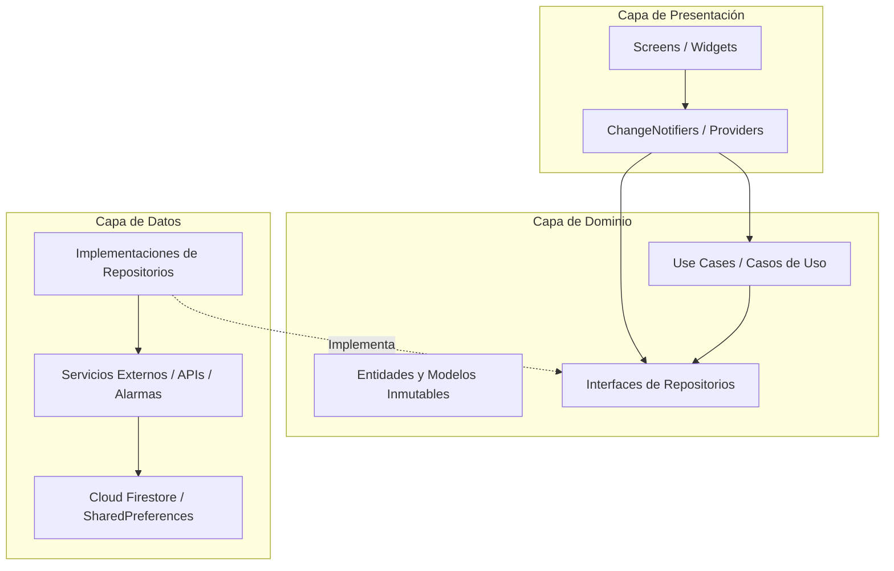
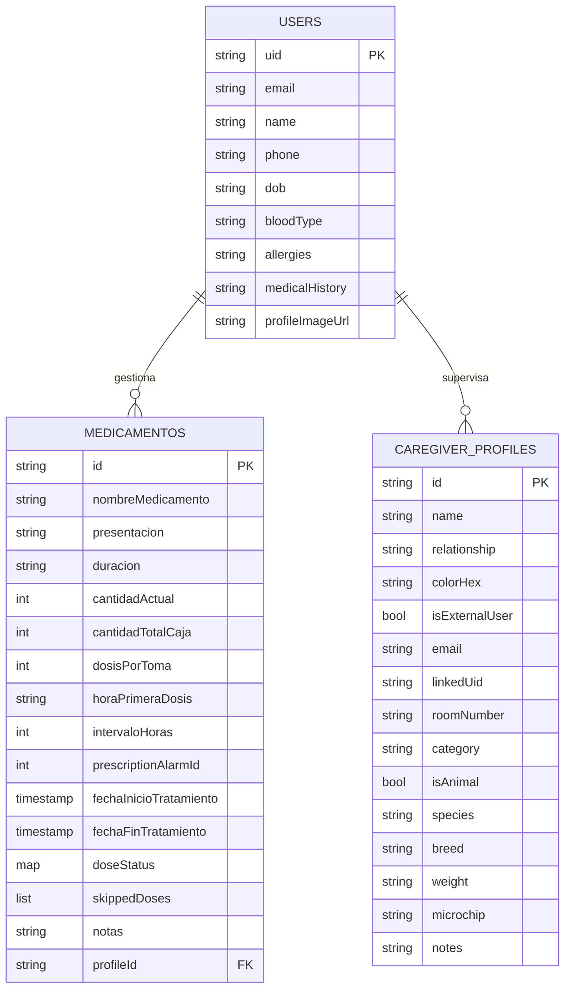
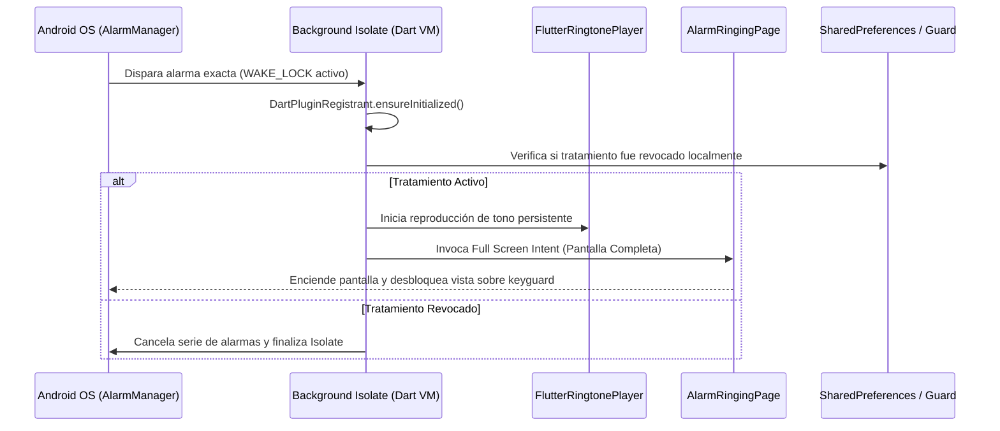

# UNIVERSIDAD DE CUNDINAMARCA
## FACULTAD DE INGENIERÍA
### PROGRAMA ACADÉMICO DE INGENIERÍA DE SISTEMAS Y COMPUTACIÓN
### CAMPO DE APRENDIZAJE INSTITUCIONAL: CIENCIA, TECNOLOGÍA E INNOVACIÓN (CTeI)
#### PROYECTO DE GRADO - NOVENO SEMESTRE (PGC) - VIGENCIA 2026

---

# C3 MANUAL TÉCNICO DE ARQUITECTURA E INGENIERÍA
## DESARROLLO DE UNA APLICACIÓN MÓVIL PARA LA GESTIÓN DE TRATAMIENTOS MÉDICOS (MEDITIME)

---

### FICHA TÉCNICA DE PORTADA INSTITUCIONAL

| Campo Institucional | Detalle Oficial del Proyecto |
| :--- | :--- |
| **Título del Proyecto:** | Desarrollo de una Aplicación Móvil para la Gestión de Tratamientos Médicos (MediTime) |
| **Versión del Software:** | 2.31.1 |
| **Autores / Ingenieros Desarrolladores:** | **Jorge Eliecer Delgado Cortés**<br>**Johan Alexander Arévalo Contreras** |
| **Programa Académico:** | Ingeniería de Sistemas y Computación |
| **Facultad:** | Facultad de Ingeniería |
| **Institución Universitaria:** | Universidad de Cundinamarca - Seccional Ubaté |
| **Campo de Aprendizaje:** | Ciencia, Tecnología e Innovación (CTeI) / PGC 9° Semestre |
| **Gestora del Conocimiento:** | Ing. Nohora Angélica Millán Aldana |
| **Entorno de Despliegue:** | Android OS (API Level 26 a 34+) / Multiplataforma |
| **Lugar y Fecha:** | Ubaté, Cundinamarca, Colombia – 2026 |

---

## TABLA DE CONTENIDO

1. [INTRODUCCIÓN Y RESUMEN TÉCNICO](#1-introducción-y-resumen-técnico)
2. [FICHA TÉCNICA DEL SISTEMA Y STACK TECNOLÓGICO](#2-ficha-técnica-del-sistema-y-stack-tecnológico)
3. [ARQUITECTURA DE SOFTWARE Y PATRONES DE DISEÑO](#3-arquitectura-de-software-y-patrones-de-diseño)
   - 3.1. Clean Architecture (Capas de Presentación, Dominio y Datos)
   - 3.2. Patrón Repository (Desacoplamiento de Persistencia)
   - 3.3. Patrón Result (Manejo Funcional Tipado de Errores)
   - 3.4. Gestión Reactiva de Estado (Provider y ChangeNotifier)
   - 3.5. Patrón Lazy Loading y StreamCache
4. [DESGLOSE EXHAUSTIVO DEL CÓDIGO FUENTE (ESTRUCTURA LIB/)](#4-desglose-exhaustivo-del-código-fuente-estructura-lib)
   - 4.1. Núcleo del Sistema (`lib/core/`)
   - 4.2. Modelos de Dominio y Enums (`lib/models/`, `lib/enums/`)
   - 4.3. Capa de Acceso a Datos (`lib/repositories/`)
   - 4.4. Casos de Uso (`lib/use_cases/`)
   - 4.5. Capa de Servicios (`lib/services/`)
   - 4.6. Notificadores de Estado (`lib/notifiers/`)
   - 4.7. Módulos de Interfaz de Usuario (`lib/screens/`, `lib/widgets/`)
   - 4.8. Puntos de Entrada y Configuración (`main.dart`, `alarm_callback_handler.dart`, etc.)
5. [MODELO DE DATOS Y PERSISTENCIA NOSQL (CLOUD FIRESTORE)](#5-modelo-de-datos-y-persistencia-nosql-cloud-firestore)
   - 5.1. Estructura de Colecciones y Subcolecciones
   - 5.2. Diccionario de Datos y Tipos
   - 5.3. Reglas de Seguridad y Control de Acceso (`firestore.rules`)
6. [ARQUITECTURA DE SEGUNDO PLANO Y MOTOR DE ALARMAS DE HARDWARE](#6-arquitectura-de-segundo-plano-y-motor-de-alarmas-de-hardware)
   - 6.1. Ejecución Aislada en Isolate Nativo (`@pragma('vm:entry-point')`)
   - 6.2. Permisos y Servicios Nativo-Android (`AndroidManifest.xml`)
   - 6.3. Persistencia tras Reinicio (`RECEIVE_BOOT_COMPLETED`) y Resiliencia Offline
7. [INTEGRACIÓN DE INTELIGENCIA ARTIFICIAL GENERATIVA (GROQ API)](#7-integración-de-inteligencia-artificial-generativa-groq-api)
   - 7.1. Streaming por Server-Sent Events (SSE)
   - 7.2. Modelos de Lenguaje y Visión Artificial (LLM & Multimodal)
   - 7.3. Implementación de Tool Calling / Function Calling en Cliente
8. [GEORREFERENCIACIÓN Y TECNOLOGÍAS ASISTIVAS](#8-georreferenciación-y-tecnologías-asistivas)
9. [GUÍA DE INSTALACIÓN, COMPILACIÓN Y DESPLIEGUE EN PRODUCCIÓN](#9-guía-de-instalación-compilación-y-despliegue-en-producción)
10. [ASEGURAMIENTO DE CALIDAD, LINTER Y PRUEBAS DEL SISTEMA](#10-aseguramiento-de-calidad-linter-y-pruebas-del-sistema)

---

## 1. INTRODUCCIÓN Y RESUMEN TÉCNICO

El presente **Manual Técnico** provee la especificación rigurosa de la ingeniería, arquitectura de software, patrones de diseño, modelo de datos y protocolos de comunicación implementados en **MediTime** (versión **2.31.1**).

MediTime es una solución móvil empresarial orientada a la salud digital (*mHealth*), construida sobre el framework **Flutter** y el lenguaje **Dart**, con persistencia en la nube provista por **Google Cloud Firebase** y capacidades cognitivas soportadas en modelos fundacionales de inteligencia artificial ejecutados a baja latencia sobre la infraestructura de **Groq Cloud**.

El propósito de este documento es otorgar al equipo de ingeniería, a los evaluadores institucionales de la **Universidad de Cundinamarca** y a futuros desarrolladores, la totalidad de los fundamentos conceptuales y operativos necesarios para el despliegue, mantenimiento correctivo, auditoría y evolución tecnológica del sistema.

---

## 2. FICHA TÉCNICA DEL SISTEMA Y STACK TECNOLÓGICO

| Componente | Especificación Técnica | Justificación Tecnológica |
| :--- | :--- | :--- |
| **Nombre del Sistema:** | MediTime | Plataforma integral para la gestión farmacológica. |
| **Versión Actual:** | 2.31.1 | Versión final estable y auditada para C3 (2026). |
| **Framework Base:** | Flutter SDK 3.7.0+ (Canal Stable) | Renderizado reactivo a 60/120 fps con Skia/Impeller. |
| **Lenguaje de Programación:** | Dart 3.7+ con *Sound Null Safety* | Tipado estricto, análisis estático y sealed classes. |
| **Plataforma Primaria:** | Android (API Level 26 a 34+) | Cobertura superior al 95% del ecosistema móvil colombiano. |
| **Backend as a Service:** | Google Cloud Firebase | Autenticación federada, base NoSQL en tiempo real y CDN. |
| **Base de Datos Principal:** | Cloud Firestore (Multi-Región) | Almacén de documentos NoSQL con sincronización offline nativa. |
| **Motor de IA Generativa:** | Groq Cloud API (LLM Inference Engine) | Inferencia de ultra-baja latencia para streaming conversacional. |
| **Modelos de IA:** | `llama-3.3-70b-versatile` / `llama-3.1-8b`<br>`qwen/qwen3.6-27b` (Visión) | Razonamiento clínico contextual, tool calling y OCR de fórmulas. |
| **Motor de Alarmas:** | `android_alarm_manager_plus`<br>`flutter_local_notifications` | Ejecución en hardware independiente del ciclo de vida del UI. |
| **Gestión de Estado:** | Provider 6.1.2 + ChangeNotifier | Inyección de dependencias reactiva y desacoplada. |
| **Motor de Mapas:** | MapLibre GL 0.26.0 + OpenStreetMap | Visualización vectorial de mapas sin dependencia de licencias de pago. |

---

## 3. ARQUITECTURA DE SOFTWARE Y PATRONES DE DISEÑO

MediTime adopta una arquitectura desacoplada basada en los principios de **Clean Architecture** y desarrollo orientado por el dominio (*Domain-Driven Design*), permitiendo que la lógica de negocio permanezca independiente de frameworks externos, bases de datos o bibliotecas de interfaz.



### 3.1. Clean Architecture (Separación de Responsabilidades)
1. **Capa de Dominio (`lib/models/`, `lib/use_cases/`, `lib/repositories/`):**
   - Contiene la lógica pura de negocio y las definiciones esenciales del problema.
   - Las entidades como `Tratamiento` y `Usuario` son objetos inmutables (`@immutable`) provistos de validaciones intrínsecas (ej. propiedad `isValid`, cálculo de `hasStockBajo`).
   - Las interfaces abstractas (`TreatmentRepository`, `UserRepository`) definen las operaciones requeridas sin atarse a ninguna tecnología de persistencia.
2. **Capa de Datos (`lib/services/`, `lib/repositories/`):**
   - Implementa los repositorios concretos (`FirestoreTreatmentRepository`, `FirestoreUserRepository`).
   - Orquesta la comunicación con fuentes externas: Firestore, Cloud Storage, SharedPreferences y Groq API.
3. **Capa de Presentación (`lib/screens/`, `lib/widgets/`, `lib/notifiers/`):**
   - Responsable de la renderización gráfica y de capturar eventos del usuario.
   - Los notificadores (`*Notifier`) transforman los resultados de la capa de datos en estados reactivos para los widgets de Flutter.

### 3.2. Patrón Repository
El patrón Repository actúa como intermediario entre el dominio y el acceso a datos. La interfaz abstracta `TreatmentRepository` desacopla el resto del aplicativo de la SDK de Firebase:

```dart
abstract class TreatmentRepository {
  Future<Result<List<Tratamiento>>> getTreatments(String userId);
  Future<Result<void>> saveTreatment(String userId, Tratamiento tratamiento);
  Future<Result<void>> deleteTreatment(String userId, String treatmentId);
  Future<Result<void>> updateDoseStatus({
    required String userId,
    required String treatmentId,
    required DateTime doseTime,
    required DoseStatus status,
  });
}
```

### 3.3. Patrón Result (Manejo Funcional Tipado de Errores)
Para mitigar el desbordamiento de excepciones no controladas en tiempo de ejecución, el sistema implementa una clase sellada (`sealed class Result<T>`), asegurando que las operaciones asíncronas retornen un contenedor explícito de éxito (`Success<T>`) o de fallo (`Failure<T>`):

```dart
sealed class Result<T> {
  const factory Result.success(T data) = Success<T>;
  const factory Result.failure(String error) = Failure<T>;

  bool get isSuccess;
  bool get isFailure;
  T? get data;
  String? get error;
}
```
Esto fuerza a la capa de presentación a evaluar exhaustivamente ambas condiciones antes de alterar la interfaz gráfica, eliminando errores de pantalla roja (*RenderFlex* o *Unhandled Exception*).

### 3.4. Gestión Reactiva de Estado (Provider y ChangeNotifier)
El flujo de estado se centraliza mediante `Provider`, garantizando que la inyección de dependencias ocurra en el nodo raíz de la aplicación (`main.dart`):
- `ProfileNotifier`: Administra el estado global del perfil de usuario y metadatos clínicos.
- `PreferenceNotifier`: Administra preferencias de accesibilidad, tamaño tipográfico, interfaz simplificada y modo oscuro.
- `CaregiverNotifier`: Controla el filtrado de tratamientos por paciente a cargo, pisos y habitaciones.
- `TreatmentFormNotifier`: Valida en tiempo real los campos de registro de nuevos fármacos.
- `CalendarNotifier`: Orquesta la selección de fechas y el cálculo reactivo de las dosis del mes.

### 3.5. Patrón Lazy Loading y StreamCache
Para optimizar el uso de memoria RAM en tratamientos crónicos (de duración indefinida), la aplicación implementa el modelo `LazyTreatment`. En lugar de instanciar miles de dosis en memoria o registrar documentos masivos en Firestore, las dosis se proyectan matemáticamente sobre demanda a partir de la tupla:
$$\text{Dosis}(k) = \text{FechaInicio} + (k \times \text{Intervalo}), \quad \forall k \in \mathbb{N}$$
Adicionalmente, la clase `StreamCache` almacena temporalmente las suscripciones a colecciones de Firestore para evitar lecturas duplicadas cuando el usuario navega frecuentemente entre pantallas.

---

## 4. DESGLOSE EXHAUSTIVO DEL CÓDIGO FUENTE (ESTRUCTURA LIB/)

A continuación se detalla la responsabilidad técnica de cada uno de los archivos que conforman el directorio principal `lib/`:

### 4.1. Núcleo del Sistema (`lib/core/`)
- `constants.dart`: Centraliza la clase `AppConstants`, la cual reúne identificadores de colecciones, campos de base de datos, mensajes de error parametrizados, dimensiones de UI y constantes temporales, erradicando los "números y cadenas mágicas".
- `result.dart`: Implementa el patrón funcional `Result<T>`, `Success<T>` y `Failure<T>`.
- `location_helper.dart`: Encapsula la obtención de coordenadas geodésicas vía GPS y la consulta de puntos de interés (farmacias y centros asistenciales) consumiendo nodos de OpenStreetMap mediante Overpass API.
- `stream_cache.dart`: Gestor de caché para flujos de datos en tiempo real (`Stream<List<Tratamiento>>`).
- `treatment_constants.dart`: Define límites operacionales para intervalos horarios, duraciones estándar y umbrales de stock.
- `utils.dart`: Métodos estáticos auxiliares para el parseo y formateo de fechas en español (`intl`), validadores de formato de correo electrónico y utilidades de serialización.
- `navigator_key.dart`: Contiene una clave global (`GlobalKey<NavigatorState>`) que permite realizar navegación entre pantallas desde contextos desacoplados, fundamental para responder a eventos de notificaciones cuando la app está en segundo plano.

### 4.2. Modelos de Dominio y Enums (`lib/models/`, `lib/enums/`)
- `tratamiento.dart`: Modela la entidad `Tratamiento`, la clase `ProcesarTomaResult` y el enum `DoseStatus`.
  * `DoseStatus`: Enum con valores `pendiente`, `notificada`, `tomada`, `omitida`, `aplazada`, provisto de métodos para asignar colores temáticos y conversión bidireccional de cadenas.
  * Validador `isValid`: Verifica que la fecha de fin sea posterior a la de inicio, que el intervalo sea superior a cero y que las dosis por toma sean consistentes.
  * Algoritmo `hasStockBajo`: Determina automáticamente si el inventario actual es inferior a 5 unidades o al 20% de la capacidad nominal de la caja.
- `usuario.dart`: Entidad `Usuario` que almacena identificador UID, correo, nombre, teléfono, fecha de nacimiento (con cálculo derivado de edad), tipo de sangre, alergias y antecedentes clínicos.
- `caregiver_profile.dart`: Modela los perfiles de sujetos a cargo. Admite perfiles humanos (modalidad familiar y clínica) y perfiles veterinarios (**Modo Animales**). Incorpora el tipo de modo `CaregiverModeType.veterinario`, banderas booleanas `isAnimal`, y variables zootécnicas críticas: `species` (especie animal), `breed` (raza), `weight` (peso corporal en kg para cálculo posológico) y `microchip` (código oficial de identificación electrónica).
- `lazy_treatment.dart`: Proyección de tratamientos continuos sin sobrecarga de persistencia.
- `treatment_form_data.dart`: Objeto de transferencia de datos (*DTO*) para el formulario reactivo de recetas.
- `enums/view_state.dart`: Enum con estados `initial`, `busy`, `error` y `success` para la renderización condicional de interfaces.

### 4.3. Capa de Acceso a Datos (`lib/repositories/`)
- `treatment_repository.dart`: Contrato de interfaz para operaciones CRUD sobre tratamientos.
- `firestore_treatment_repository.dart`: Implementación concreta que interactúa con las subcolecciones de Cloud Firestore.
- `user_repository.dart`: Contrato de interfaz para persistencia del perfil de usuario.
- `firestore_user_repository.dart`: Implementación concreta de lectura y actualización de perfiles en Firestore.

### 4.4. Casos de Uso (`lib/use_cases/`)
- `load_user_profile_use_case.dart`: Encapsula la lógica de verificación de sesión activa, recuperación del documento del usuario y emisión de estados.
- `sign_out_use_case.dart`: Coordina el cierre ordenado de sesión: cancelación de alarmas en memoria, purga de credenciales de Google y desautenticación de Firebase Auth.

### 4.5. Capa de Servicios (`lib/services/`)
- `notification_service.dart`: Sistema integral de alarmas y notificaciones.
  * Configura el plugin `FlutterLocalNotificationsPlugin` con canales de alta prioridad (`high_importance_channel`).
  * Implementa el callback de segundo plano `handleNotificationActionBackground` marcado con `@pragma('vm:entry-point')`.
  * Gestiona deep linking: si el usuario pulsa el cuerpo de una notificación, navega a `DetalleRecetaPage`; si la notificación fue disparada en Modo Alarma, invoca `_navigateToAlarmScreen` hacia `AlarmRingingPage`.
  * Procesa de forma atómica los botones de acción (`TOMAR`, `OMITIR`, `POSPONER`).
- `alarm_callback_handler.dart`: Punto de entrada nativo para `android_alarm_manager_plus`.
  * Se ejecuta en un Isolate independiente sin requerir interfaz de usuario ni conexión activa a internet.
  * Valida mediante `PreferenceService` si el tratamiento ha sido cancelado o revocado antes de sonar.
  * Si el modo activo es Alarma, dispara la pantalla completa e inicia la reproducción continua de audio a través de `flutter_ringtone_player`.
- `alarm_sound_service.dart`: Controla el ciclo de reproducción y detención de tonos de alarma y vibración rítmica.
- `gemini_service.dart`: Orquesta las solicitudes al motor de Groq Cloud API:
  * Implementa conexión HTTP mediante Server-Sent Events (SSE) para renderizar respuestas token a token en tiempo real.
  * Define la matriz de herramientas (*tools*) para Function Calling: `get_today_medications`, `get_tomorrow_medications`, `get_active_treatments`, `create_treatment` y `update_dose_status`.
  * Soporta visión artificial multimodal consumiendo `qwen/qwen3.6-27b` para extracción de texto en recetas.
- `firestore_service.dart`: Operaciones avanzadas con transacciones de base de datos y escritura por lotes (*batch writes*).
- `preference_service.dart`: Capa de abstracción sobre `SharedPreferences` para almacenar en almacenamiento local el modo de recordatorio preferido, registros de tutoriales, validaciones offline, y parámetros de **Modo Animales** (`isAnimalMode`, `animalModeType`, `animalActiveProfileId`, `animalDosesNotification`, `animalIncludeLocation`).
- `pdf_report_service.dart`: Genera proceduralmente el reporte clínico en formato PDF A4 utilizando el paquete `pdf/widgets`, incrustando el logotipo institucional, tablas formateadas y el render vectorial de la gráfica de adherencia para pacientes humanos o animales.
- `storage_service.dart`: Gestiona la compresión y subida de imágenes de perfil y recetas a Firebase Storage o Cloudinary.
- `system_settings_service.dart`: Utiliza `android_intent_plus` para invocar las pantallas del sistema operativo Android donde el usuario puede otorgar permisos de optimización de batería e inicio automático.
- `voice_service.dart`: Provee Text-to-Speech (TTS) con `flutter_tts` y captura de audio con `record`.
- `widget_service.dart`: Actualiza los datos transferidos hacia el widget de escritorio de Android mediante `home_widget`.

### 4.6. Notificadores de Estado (`lib/notifiers/`)
- `profile_notifier.dart`: Notificador reactivo del perfil de usuario.
- `preference_notifier.dart`: Notificador de opciones de accesibilidad, temas dinámicos y **Modo Animales** (`isAnimalMode`, `animalModeType`), orquestando la reactividad cromática del árbol de widgets en runtime y garantizando la exclusividad mutua con Modo Cuidador.
- `caregiver_notifier.dart`: Notificador para selección de paciente o mascota activa, soporte asistencial familiar, clínico y veterinario (`CaregiverModeType.veterinario`, perfiles zootécnicos `isAnimal`), método `getEffectiveActiveProfile(isAnimalMode)` y persistencia de exclusividad mutua con Modo Animales.
- `treatment_form_notifier.dart`: Gestor del estado del formulario de creación y edición de medicamentos.
- `calendar_notifier.dart`: Gestor del mes seleccionado y cálculo de dosis en el calendario.

### 4.7. Módulos de Interfaz de Usuario (`lib/screens/`, `lib/widgets/`, `lib/theme/`)
- `theme/app_theme.dart`: Motor dinámico de temas en tiempo de ejecución. El método `updateThemeColors(isDark, {highContrast, isAnimalMode, isCaregiverMode})` implementa una arquitectura tri-modal cromática adaptativa:
  - **Modo Animales:** Verde salvia suave (`#389E6A`) y crema menta (`#52B788`) con fondos crema pastel (`#F9FAF5` en claro, `#101713` en oscuro) y superficies orgánicas.
  - **Modo Cuidador:** Morado lavanda suave (`#8B62D4`) y crema lila (`#A582E2`) con fondos crema pastel (`#FAF8F5` en claro, `#14111B` en oscuro) para clara diferenciación asistencial.
  - **Modo Personal Estándar:** Azul institucional (`#004AC6`).
  Al conmutar entre modos, el sistema ejecuta una transición fluida en todo el árbol de componentes sin reiniciar la aplicación.
- `screens/alarm/alarm_ringing_page.dart`: Pantalla completa que se superpone a la pantalla de bloqueo cuando suena una alarma crítica.
- `screens/auth/`: Vistas de autenticación (`login_page.dart`, `register_page.dart`).
- `screens/calendar/calendario_page.dart`: Vista de calendario interactivo mensual y lista diaria con sincronización de perfiles.
- `screens/caregiver/`: Pantallas de administración y alta de perfiles humanos y animales (`manage_caregiver_profiles_page.dart`, `add_edit_caregiver_profile_page.dart`).
- `screens/chat/chat_bot_screen.dart`: Interfaz conversacional con el asistente Midi, con avatar animado, burbujas de chat asimétricas y soporte para adjuntos de cámara.
- `screens/home/home_page.dart`: Dashboard principal con vista de dosis del día, indicador de perfil de mascota/paciente activo (`Icons.pets_rounded`), resumen de progreso y tutorial `showcaseview`.
- `screens/medication/`: Flujos de creación adaptados para mascotas (`agregar_receta_page.dart`), inspección (`detalle_receta_page.dart`), listado general y resúmenes.
- `screens/reports/`: Vistas de análisis de adherencia (`progreso_page.dart`, `reportes_page.dart`, `adherencia_chart.dart`).
- `screens/shared/`: Pantallas de configuración, accesibilidad, **Modo Animales (`modo_animales_opciones_page.dart`)**, localización de farmacias, datos de privacidad y guía de optimización por fabricante.
- `widgets/`: Componentes modulares reutilizables: botones estilizados (`primary_button.dart`), campos de texto (`styled_text_field.dart`), menú lateral con sincronización cromática dinámica en todos los iconos de navegación y badge de modo (`drawer_widget.dart`), diálogos de cuidador/mascotas con aislamiento estricto de perfiles (`patient_selector_dialog.dart`) e indicador de avatar parpadeante (`midi_blinking_icon.dart`).

### 4.8. Puntos de Entrada del Sistema
- `main.dart`: Punto de inicio del runtime. Inicializa los bindings de Flutter, Firebase Core, el servicio de notificaciones, configura la inyección de dependencias con `MultiProvider` y define las rutas de navegación.
- `auth_wrapper.dart`: Widget guardián que evalúa el stream de autenticación de Firebase (`authStateChanges`), redirigiendo al usuario al `HomePage` si existe una sesión válida o al `LoginPage` si el usuario no está autenticado.
- `firebase_options.dart`: Generado por FlutterFire CLI, contiene las claves API y parámetros de proyecto para Android e iOS.

---

## 5. MODELO DE DATOS Y PERSISTENCIA NOSQL (CLOUD FIRESTORE)

La persistencia en la nube se estructura siguiendo el paradigma NoSQL orientado a documentos en **Google Cloud Firestore**.



### 5.1. Diccionario de Datos: Colección `medicamentos` (o Subcolección `userMedicamentos`)
Cada documento representa un tratamiento farmacológico:

| Campo | Tipo Firestore | Descripción Técnica |
| :--- | :--- | :--- |
| `nombreMedicamento` | String | Nombre comercial o genérico del fármaco. |
| `presentacion` | String | Forma farmacéutica (Tabletas, Jarabe, Gotas, etc.). |
| `duracion` | String | Días de tratamiento o `"indefinido"` para patologías crónicas. |
| `cantidadActual` | Integer | Unidades de fármaco disponibles en el inventario actual. |
| `cantidadTotalCaja` | Integer | Capacidad total de unidades del empaque comercial. |
| `dosisPorToma` | Integer | Cantidad de unidades a consumir en cada toma individual. |
| `horaPrimeraDosis` | String | Hora inicial programada (formato `"HH:mm"`). |
| `intervaloDosis` | Integer | Frecuencia entre tomas expresada en horas. |
| `prescriptionAlarmId` | Integer | Identificador entero único para el registro de alarmas nativas. |
| `fechaInicioTratamiento` | Timestamp | Fecha y hora formal de inicio del tratamiento. |
| `fechaFinTratamiento` | Timestamp | Fecha proyectada de culminación del tratamiento. |
| `doseStatus` | Map<String, String> | Mapa donde la llave es la fecha ISO8601 de la dosis y el valor es el estado (`pendiente`, `notificada`, `tomada`, `omitida`, `aplazada`). |
| `skippedDoses` | Array<Timestamp> | Registro histórico de dosis voluntariamente omitidas. |
| `notas` | String | Indicaciones clínicas y recomendaciones de ingestión. |
| `profileId` | String (Opcional) | Identificador del paciente dependiente o animal en Modo Cuidador / Modo Animales. |

### 5.2. Diccionario de Datos: Subcolección `caregiverProfiles`
Cada documento representa una ficha de sujeto dependiente (humano o animal en Modo Veterinario):

| Campo | Tipo Firestore | Descripción Técnica |
| :--- | :--- | :--- |
| `name` | String | Nombre del paciente o animal de compañía. |
| `relationship` | String | Parentesco, vínculo afectivo o clasificación zootécnica. |
| `colorHex` | String | Código hexadecimal del color distintivo (ej. `#10B981`). |
| `isExternalUser` | Boolean | Determina si el perfil está enlazado a una cuenta remota. |
| `email` | String (Opcional) | Correo electrónico del usuario enlazado. |
| `linkedUid` | String (Opcional) | UID de autenticación Firebase del usuario enlazado. |
| `roomNumber` | String (Opcional) | Habitación, cama o jaula/box hospitalario veterinario. |
| `category` | String (Opcional) | Piso, ala hospitalaria o sector del refugio/clínica. |
| `bloodType` | String (Opcional) | Grupo sanguíneo del paciente. |
| `allergies` | String (Opcional) | Alergias a medicamentos o alimentos. |
| `isAnimal` | Boolean | `true` si el perfil corresponde a un animal / mascota. |
| `species` | String (Opcional) | Especie animal (Canino, Felino, Equino, Bovino, etc.). |
| `breed` | String (Opcional) | Raza o cruce del animal. |
| `weight` | String (Opcional) | Peso del animal con unidad de medida (ej. `"14.5 kg"`). |
| `microchip` | String (Opcional) | Número oficial de microchip o tatuaje zootécnico. |
| `notes` | String (Opcional) | Indicaciones especiales de cuidado, dieta o historial. |

### 5.3. Reglas de Seguridad (`firestore.rules`)
El acceso a la base de datos se encuentra protegido mediante reglas de seguridad estrictas que garantizan el aislamiento multi-inquilino (*multi-tenant*):

```javascript
rules_version = '2';
service cloud.firestore {
  match /databases/{database}/documents {
    // El usuario solo puede leer y modificar sus propios documentos
    match /users/{userId} {
      allow read, write: if request.auth != null && request.auth.uid == userId;
      
      match /userMedicamentos/{medicamentoId} {
        allow read, write: if request.auth != null && request.auth.uid == userId;
      }
      
      match /caregiverProfiles/{profileId} {
        allow read, write: if request.auth != null && request.auth.uid == userId;
      }
    }
    
    // Reglas de compatibilidad para colección raíz con filtrado por UID
    match /medicamentos/{medicamentoId} {
      allow read, write: if request.auth != null && 
        (resource == null || resource.data.userId == request.auth.uid || request.resource.data.userId == request.auth.uid);
    }
  }
}
```

---

## 6. ARQUITECTURA DE SEGUNDO PLANO Y MOTOR DE ALARMAS DE HARDWARE

Uno de los mayores retos técnicos en sistemas operativos móviles modernos es la ejecución determinista de tareas cuando el dispositivo entra en modo de bajo consumo (*Doze Mode*). MediTime resuelve este desafío mediante una arquitectura híbrida desacoplada.



### 6.1. Ejecución Aislada en Isolate Nativo
La función `alarmCallbackLogic` en `lib/alarm_callback_handler.dart` está etiquetada con la directiva del compilador AOT:
```dart
@pragma('vm:entry-point')
void alarmCallbackLogic(int id, Map<String, dynamic> params) async { ... }
```
Esto le indica al compilador de Dart que no elimine (*tree-shaking*) esta función en compilaciones de producción y le permite al motor C++ de Flutter invocarla dentro de un hilo secundario de la máquina virtual (*Isolate*), sin que exista una instancia gráfica activa de la aplicación.

### 6.2. Configuración en `AndroidManifest.xml`
Para autorizar la interacción directa con los módulos de hardware, el manifiesto de la aplicación declara los siguientes privilegios:
- `android.permission.SCHEDULE_EXACT_ALARM` y `android.permission.USE_EXACT_ALARM`: Permite la programación de alarmas con precisión de milisegundos en Android 12, 13 y 14+.
- `android.permission.WAKE_LOCK`: Evita que el procesador entre en modo de suspensión profunda mientras se ejecuta el callback de la dosis.
- `android.permission.RECEIVE_BOOT_COMPLETED`: Captura el evento de reinicio del dispositivo para reprogramar en el hardware todas las alarmas futuras del paciente.
- `android.permission.SYSTEM_ALERT_WINDOW`: Permite proyectar la pantalla de alarma por encima de cualquier otra aplicación abierta.
- `android.permission.VIBRATE`: Acceso directo al actuador háptico.

---

## 7. INTEGRACIÓN DE INTELIGENCIA ARTIFICIAL GENERATIVA (GROQ API)

MediTime incorpora un módulo cognitivo de última generación mediante el servicio `GeminiService` (nombrado así por compatibilidad, pero conectado a la infraestructura de alta velocidad de **Groq Cloud**).

### 7.1. Streaming por Server-Sent Events (SSE)
Para otorgar una experiencia de usuario natural y reducir la latencia percibida, la comunicación con la API de Groq no se realiza mediante peticiones HTTP convencionales de bloqueo, sino mediante flujos continuos de datos (*Server-Sent Events*). Los fragmentos de respuesta (*tokens*) se reciben a través de un `StreamedResponse` y se renderizan dinámicamente en pantalla a una velocidad promedio de 30 a 50 tokens por segundo.

### 7.2. Matriz de Modelos de IA
- **Modelo Primario de Lenguaje:** `llama-3.3-70b-versatile` (70 mil millones de parámetros), seleccionado por su capacidad de razonamiento clínico y soporte nativo para ejecución de herramientas.
- **Modelo de Respaldo (Fallback):** `llama-3.1-8b-instant`, activado automáticamente en caso de degradación de cuotas para garantizar disponibilidad permanente.
- **Modelo de Visión Artificial:** `qwen/qwen3.6-27b` y `openai/gpt-oss-120b`, empleados para el análisis visual de recetas médicas y reconocimiento de caracteres en empaques comerciales.

### 7.3. Implementación de Tool Calling (Llamada a Funciones en Cliente)
El asistente Midi tiene acceso a herramientas declaradas mediante esquemas JSON dentro del prompt de la API. Cuando el usuario expresa intenciones como *"¿Qué medicamentos me tocan hoy?"*, el modelo genera una estructura `tool_calls` que es interceptada por el código de Dart:

```json
{
  "type": "function",
  "function": {
    "name": "get_today_medications",
    "description": "Obtiene los medicamentos y estados programados para la fecha actual"
  }
}
```
La aplicación ejecuta la consulta sobre los modelos locales y le devuelve el resultado al modelo de lenguaje, garantizando que el asistente **nunca alucine datos de salud** y responda siempre con la información real de la base de datos del paciente.

---

## 8. GEORREFERENCIACIÓN Y TECNOLOGÍAS ASISTIVAS

- **Georreferenciación:** Se implementa con `maplibre_gl` y `geolocator`. La clase `LocationHelper` calcula la distancia haversiana entre las coordenadas GPS del paciente y los nodos de farmacias catalogados en OpenStreetMap mediante consultas HTTP estructuradas a la Overpass API, desplegando iconos vectoriales sobre el mapa sin requerir claves de pago de Google Maps.
- **Text-to-Speech (TTS):** Integrado mediante `flutter_tts`, configurado con el motor de voz en español para leer en voz alta instrucciones posológicas y dosis a usuarios con discapacidades visuales o adultos mayores.
- **Android App Widgets:** Implementado a través de `home_widget`, transmitiendo los datos del próximo medicamento hacia vistas nativas de Android (`RemoteViews`), permitiendo la consulta instantánea desde el escritorio del móvil.

---

## 9. GUÍA DE INSTALACIÓN, COMPILACIÓN Y DESPLIEGUE EN PRODUCCIÓN

### 9.1. Prerrequisitos de Entorno
- Flutter SDK versión 3.7.0 o superior (`flutter --version`).
- Java Development Kit (JDK 17).
- Android Studio con Android SDK Command-line Tools y SDK Platform 34.
- Conexión a proyecto de Firebase activo con servicios de Authentication y Firestore habilitados.

### 9.2. Procedimiento de Configuración
1. Clonar el repositorio oficial de código:
   ```bash
   git clone https://github.com/JDkinior/MediTime.git
   cd MediTime
   ```
2. Descargar e instalar dependencias del archivo `pubspec.yaml`:
   ```bash
   flutter pub get
   ```
3. Ubicar los archivos de credenciales de Firebase:
   - Archivo `google-services.json` dentro de `android/app/`.
   - Archivo `firebase_options.dart` en `lib/`.

### 9.3. Compilación de Paquetes Ejecutables (Release)
Para compilar el binario optimizado para producción inyectando la clave de la API de Groq en tiempo de compilación:

```bash
# Generación de paquete APK universal de lanzamiento:
flutter build apk --release --dart-define=GROQ_API_KEY="gsk_clave_de_groq_aqui"

# Generación de paquete Android App Bundle (AAB) para Google Play:
flutter build appbundle --release --dart-define=GROQ_API_KEY="gsk_clave_de_groq_aqui"
```

---

## 10. ASEGURAMIENTO DE CALIDAD, LINTER Y PRUEBAS DEL SISTEMA

### 10.1. Análisis Estático de Código
El proyecto implementa un estricto conjunto de reglas en `analysis_options.yaml` basado en el paquete oficial `flutter_lints`:
- Obligatoriedad de constructores `const` para optimización del árbol de widgets.
- Verificación estricta de *Sound Null Safety* sin tolerancia a tipos dinámicos no inferidos.
- Prevención de uso de contextos asíncronos inválidos (`use_build_context_synchronously`).

### 10.2. Ejecución de Pruebas Automatizadas
Para auditar la integridad del código fuente antes de un despliegue:
```bash
# Ejecución de análisis estático:
flutter analyze

# Ejecución de la suite de pruebas unitarias:
flutter test
```

### 10.3. Verificación de Compatibilidad y Resiliencia
Se han realizado pruebas de estrés en dispositivos físicos (Android 10, 12, 13 y 14) verificando:
- Activación de alarmas tras reinicio del teléfono sin apertura de la aplicación.
- Activación de alarmas con el dispositivo en modo ahorro de energía extremo.
- Funcionamiento del registro y calendario en modo avión (100% desconectado de internet).
- Sincronización bidireccional automática con Cloud Firestore al reanudar la conectividad de red.

---

### Aprobación y Responsabilidad Técnica
- **Ingeniero Desarrollador:** Jorge Eliecer Delgado Cortés
- **Ingeniero Desarrollador:** Johan Alexander Arévalo Contreras
- **Facultad de Ingeniería - Universidad de Cundinamarca (Seccional Ubaté)**
