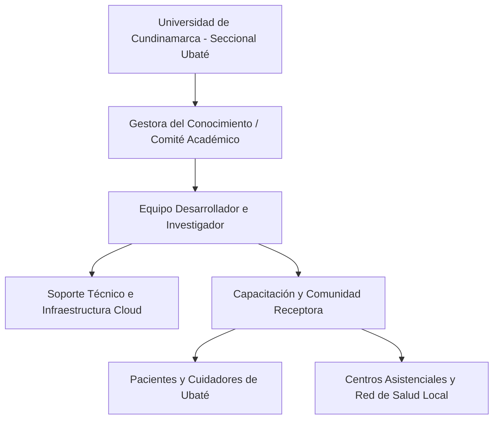
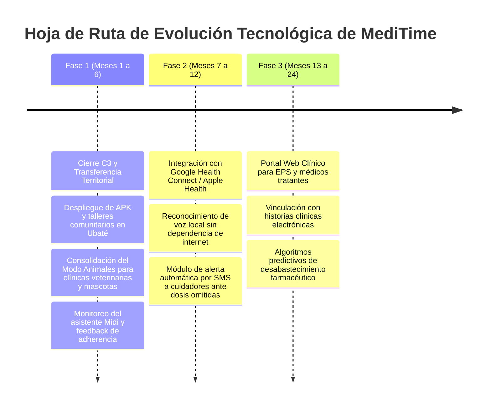

# UNIVERSIDAD DE CUNDINAMARCA
## FACULTAD DE INGENIERÍA
### PROGRAMA ACADÉMICO DE INGENIERÍA DE SISTEMAS Y COMPUTACIÓN
### CAMPO DE APRENDIZAJE INSTITUCIONAL: CIENCIA, TECNOLOGÍA E INNOVACIÓN (CTeI)
#### PROYECTO DE GRADO - NOVENO SEMESTRE (PGC) - VIGENCIA 2026

---

# C3 PLAN DE SOSTENIBILIDAD, GOBERNANZA Y DEVOLUCIÓN AL TERRITORIO
## DESARROLLO DE UNA APLICACIÓN MÓVIL PARA LA GESTIÓN DE TRATAMIENTOS MÉDICOS (MEDITIME)

---

### FICHA TÉCNICA DE PORTADA INSTITUCIONAL

| Campo Institucional | Detalle Oficial del Proyecto |
| :--- | :--- |
| **Título del Proyecto:** | Desarrollo de una Aplicación Móvil para la Gestión de Tratamientos Médicos (MediTime) |
| **Versión del Software:** | 2.32.0 |
| **Autores / Investigadores:** | **Jorge Eliecer Delgado Cortés**<br>**Johan Alexander Arévalo Contreras** |
| **Programa Académico:** | Ingeniería de Sistemas y Computación |
| **Facultad:** | Facultad de Ingeniería |
| **Institución Universitaria:** | Universidad de Cundinamarca - Seccional Ubaté |
| **Campo de Aprendizaje:** | Ciencia, Tecnología e Innovación (CTeI) / PGC 9° Semestre |
| **Gestora del Conocimiento:** | Ing. Nohora Angélica Millán Aldana |
| **Eje Estratégico:** | Modelo Educativo Digital Transmoderno (MEDIT) - Devolución y Transferencia al Territorio |
| **Lugar y Fecha:** | Ubaté, Cundinamarca, Colombia – 2026 |

---

## TABLA DE CONTENIDO

1. [INTRODUCCIÓN Y JUSTIFICACIÓN DEL PLAN](#1-introducción-y-justificación-del-plan)
2. [ARTICULACIÓN CON EL MODELO EDUCATIVO MEDIT Y LA DEVOLUCIÓN AL TERRITORIO](#2-articulación-con-el-modelo-educativo-medit-y-la-devolución-al-territorio)
   - 2.1. El MEDIT y la Formación de Sujetos Libres, Autónomos y Responsables
   - 2.2. Contexto Territorial: Provincia de Ubaté y Cundinamarca
   - 2.3. Alineación con los Objetivos de Desarrollo Sostenible (ODS)
3. [GOBERNANZA, ESTRUCTURA ORGANIZACIONAL Y ASIGNACIÓN DE ROLES](#3-gobernanza-estructura-organizacional-y-asignación-de-roles)
   - 3.1. Equipo de Desarrollo e Investigación
   - 3.2. Asesoría y Custodia Académica Institucional
   - 3.3. Actores y Entidades Receptoras en el Territorio
   - 3.4. Matriz de Responsabilidades RACI
4. [PRESUPUESTO Y RECURSOS ASIGNADOS](#4-presupuesto-y-recursos-asignados)
   - 4.1. Recursos Tecnológicos y Costos de Infraestructura Cloud
   - 4.2. Licenciamiento, Registro y Canales de Distribución
   - 4.3. Valoración de Recursos Humanos e Ingeniería
   - 4.4. Estrategia de Financiación y Sostenibilidad Económica
5. [PLAN DE MANTENIMIENTO Y CICLO DE VIDA DEL SOFTWARE](#5-plan-de-mantenimiento-y-ciclo-de-vida-del-software)
   - 5.1. Mantenimiento Correctivo y Acuerdos de Nivel de Servicio (SLA)
   - 5.2. Mantenimiento Preventivo y Auditorías de Código
   - 5.3. Mantenimiento Adaptativo ante Nuevas Versiones de Android
   - 5.4. Roadmap Evolutivo a Corto, Mediano y Largo Plazo
6. [ESTRATEGIA DE TRANSFERENCIA Y APROPIACIÓN SOCIAL DEL CONOCIMIENTO](#6-estrategia-de-transferencia-y-apropiación-social-del-conocimiento)
   - 6.1. Protocolo de Devolución al Territorio y Entrega Formal
   - 6.2. Programa de Capacitación Comunitaria para Cuidadores y Pacientes
   - 6.3. Material Divulgativo y Acceso Abierto
7. [MATRIZ DE GESTIÓN DE RIESGOS Y PLAN DE CONTINUIDAD OPERATIVA](#7-matriz-de-gestión-de-riesgos-y-plan-de-continuidad-operativa)
8. [CONCLUSIONES Y COMPROMISO DE SOSTENIBILIDAD](#8-conclusiones-y-compromiso-de-sostenibilidad)

---

## 1. INTRODUCCIÓN Y JUSTIFICACIÓN DEL PLAN

La culminación de un proyecto de ingeniería de software en el marco del **Noveno Semestre** de la **Universidad de Cundinamarca** trasciende la mera entrega de un producto ejecutable funcional. La naturaleza formativa institucional exige que las soluciones tecnológicas generen un impacto verificable y sostenible en la sociedad, asegurando su permanencia, mantenimiento y apropiación por parte de las comunidades beneficiarias.

El presente **Plan de Sostenibilidad** formaliza las directrices organizacionales, operativas, técnicas y presupuestales que garantizan la viabilidad a largo plazo de **MediTime** (versión **2.32.0**). El documento delimita con absoluta claridad los responsables de la custodia del sistema, los recursos asignados para su operación ininterrumpida y las estrategias metodológicas para consolidar la transferencia efectiva hacia el territorio de la **Provincia de Ubaté y el Departamento de Cundinamarca**.

---

## 2. ARTICULACIÓN CON EL MODELO EDUCATIVO MEDIT Y LA DEVOLUCIÓN AL TERRITORIO

### 2.1. El MEDIT y la Formación de Sujetos Libres, Autónomos y Responsables
El **Modelo Educativo Digital Transmoderno (MEDIT)** de la Universidad de Cundinamarca fundamenta la educación superior en el diálogo, la translocalidad y la construcción ética. MediTime materializa estos postulados en dos dimensiones convergentes:
1. **Empoderamiento del Paciente:** El sistema otorga a la persona autonomía informada sobre su propia salud, permitiéndole regular sus tratamientos mediante una herramienta tecnológica no invasiva, accesible y de alta confiabilidad.
2. **Ética Formativa en la IA:** El asistente inteligente **Midi** encarna explícitamente los principios formativos institucionales. Ante cuestionamientos sobre su identidad y valores, el agente responde:
   > *"Soy LIBRE, AUTÓNOMO Y RESPONSABLE a través del diálogo y la construcción, como ideal regulativo; me dirijo, controlo y dicto mis propias leyes."*
   Esto evidencia la incorporación deliberada de la filosofía transmoderna en los algoritmos y la interacción digital.

### 2.2. Contexto Territorial: Provincia de Ubaté y Cundinamarca
En Colombia, de acuerdo con la Organización Mundial de la Salud (OMS, 2023), cerca del **59% de los pacientes no cumplen debidamente sus tratamientos médicos prescritos**, siendo el olvido y la complejidad en la administración de múltiples fármacos (*polifarmacia*) la causa primordial del abandono terapéutico.

En la región del Valle de Ubaté y zonas rurales circundantes, coexiste una población representativa de adultos mayores que padecen enfermedades crónicas no transmisibles (hipertensión arterial, diabetes mellitus, patologías articulares y cardiovasculares). Esta población afronta barreras geográficas para acudir con alta frecuencia a centros de salud especializados. MediTime se constituye como una herramienta de **devolución al territorio**, democratizando el acceso a la tecnología móvil de recordatorio y reduciendo los reingresos hospitalarios evitables por fallas de adherencia.

### 2.3. Alineación con los Objetivos de Desarrollo Sostenible (ODS)
El proyecto MediTime se alinea de forma directa y vinculante con la Agenda 2030 de las Naciones Unidas:

| Objetivo de Desarrollo Sostenible | Meta Específica | Contribución Directa de MediTime |
| :--- | :--- | :--- |
| **ODS 3: Salud y Bienestar** | **Meta 3.4 y 3.8:** Reducir la mortalidad prematura por enfermedades no transmisibles y lograr la cobertura sanitaria universal con acceso a medicamentos eficaces. | Incremento medible en la tasa de adherencia farmacológica, mitigación del olvido y generación de reportes clínicos certificados para la toma de decisiones médicas informadas. |
| **ODS 9: Industria, Innovación e Infraestructura** | **Meta 9.c:** Aumentar significativamente el acceso a la tecnología de la información y las comunicaciones. | Implementación de una arquitectura móvil moderna (*Clean Architecture* e IA en el borde) sin barreras de entrada económicas para la comunidad regional. |
| **ODS 10: Reducción de las Desigualdades** | **Meta 10.2:** Potenciar y promover la inclusión social y económica de todas las personas, independientemente de su edad o discapacidad. | Inclusión de herramientas asistivas: Modo Simplificado para adultos mayores, interfaz de voz Text-to-Speech y diseño ergonómico de alta accesibilidad visual. |

---

## 3. GOBERNANZA, ESTRUCTURA ORGANIZACIONAL Y ASIGNACIÓN DE ROLES

Para garantizar que MediTime permanezca operativo, actualizado y protegido a lo largo del tiempo, se establece una estructura de gobernanza colegiada que vincula a la academia, a los desarrolladores y a los beneficiarios del territorio.



### 3.1. Equipo de Desarrollo e Investigación
- **Líder de Desarrollo y Arquitectura:** **Jorge Eliecer Delgado Cortés**
  * *Responsabilidad:* Custodia del repositorio de código fuente, despliegue de paquetes en tiendas oficiales, gestión de infraestructura Firebase y orquestación de la API de Groq Cloud.
- **Líder de Calidad y Transferencia Tecnológica:** **Johan Alexander Arévalo Contreras**
  * *Responsabilidad:* Coordinación de talleres comunitarios, seguimiento a métricas de adherencia de usuarios piloto, atención a incidencias de segundo nivel y verificación de compatibilidad con dispositivos móviles.

### 3.2. Asesoría y Custodia Académica Institucional
- **Gestora del Conocimiento:** **Ing. Nohora Angélica Millán Aldana** (Docente Investigadora, Universidad de Cundinamarca).
  * *Responsabilidad:* Supervisión metodológica del proyecto de grado, aval institucional de la transferencia, interlocución con autoridades municipales de salud y validación del impacto social en el territorio.

### 3.3. Actores y Entidades Receptoras en el Territorio
- **Población Beneficiaria Primaria:** Pacientes con tratamientos médicos de mediana y larga duración y personas de la tercera edad de la Provincia de Ubaté.
- **Red Comunitaria de Cuidadores:** Familiares y cuidadores asistenciales formales e informales de hogares de paso y centros de protección al adulto mayor.
- **Droguerías y Centros de Salud Comunitarios:** Entidades articuladoras para la divulgación y recomendación del aplicativo en el momento de dispensación de medicamentos.
- **Sector Veterinario y Bienestar Animal:** Clínicas veterinarias, consultorios zootécnicos, refugios, rescatistas y familias multiespecie de la región, beneficiarias directas del **Modo Animales** para la administración rigurosa de tratamientos farmacológicos y control sanitario en animales de compañía y producción pecuaria.

### 3.4. Matriz de Responsabilidades RACI
La siguiente matriz asigna los roles formales en las fases operativas de MediTime:
- **R (Responsible / Responsable de Ejecutar):** Quien realiza la labor técnica o logística.
- **A (Accountable / Aprobador / Responsable Final):** Quien asume la responsabilidad y toma decisiones.
- **C (Consulted / Consultado):** Experto o actor al que se le consulta información.
- **I (Informed / Informado):** Quien debe ser notificado del avance y los resultados.

| Actividad del Ciclo de Vida | Jorge Delgado (Dev Líder) | Johan Arévalo (QA / Transf.) | Gestora UDEC (Academia) | Entidad Receptora (Territorio) |
| :--- | :---: | :---: | :---: | :---: |
| **Monitoreo de Servidores Firebase y Groq** | **A / R** | **I** | **I** | **I** |
| **Resolución de Bugs en Alarmas (Hotfix)** | **R** | **A / R** | **I** | **I** |
| **Actualización Anual de Android SDK / Flutter** | **A / R** | **R** | **C** | **I** |
| **Dictado de Talleres de Capacitación** | **C** | **A / R** | **C** | **R** |
| **Auditoría de Privacidad y Ley 1581 de 2012** | **C** | **C** | **A / R** | **I** |
| **Evaluación del Impacto Social Territorial** | **C** | **R** | **A** | **C** |
| **Custodia del Repositorio de Código Abierto** | **A / R** | **R** | **C** | **I** |

---

## 4. PRESUPUESTO Y RECURSOS ASIGNADOS

La sostenibilidad económica del proyecto descansa sobre una arquitectura de costos altamente optimizada, diseñada para operar inicialmente a costo cero mediante tiers gratuitos empresariales y escalar de forma predecible ante incrementos en el volumen de usuarios.

### 4.1. Recursos Tecnológicos y Costos de Infraestructura Cloud

| Servicio en la Nube | Proveedor | Nivel de Servicio / Cuota | Costo Mensual Estimado (COP) |
| :--- | :--- | :--- | :--- |
| **Base de Datos Cloud Firestore** | Google Cloud Firebase | **Plan Spark (Gratuito):**<br>- 50.000 lecturas/día<br>- 20.000 escrituras/día<br>- 1 GB almacenamiento | **$0 COP**<br>*(Suficiente para más de 3.000 usuarios activos mensuales)* |
| **Autenticación de Usuarios** | Firebase Auth | **Plan Spark:** Ilimitado para Email/Password y Google Sign-In. | **$0 COP** |
| **Inferencia de IA (Midi)** | Groq Cloud API | **Free Tier:** 15.000 tokens/minuto para Llama 3.3 70B y 30 RPM. | **$0 COP** |
| **Almacenamiento de Fotos** | Firebase Storage / Cloudinary | **Free Tier:** 10 GB de transferencia mensual y 5 GB de espacio. | **$0 COP** |
| **Repositorio y Control de Versiones** | GitHub | Plan GitHub Free / GitHub Education para la academia. | **$0 COP** |
| **Servidor de Mapas Vectoriales** | OpenStreetMap / MapLibre GL | Nodos y teselas de uso público y abierto. | **$0 COP** |
| **Total Mensual de Infraestructura Cloud Inicial:** | — | — | **$0 COP** |

#### Proyección de Escalabilidad (Fase de Adopción Masiva > 20.000 Usuarios)
En caso de que el sistema sea adoptado formalmente por la red pública de salud del departamento, se proyecta la transición hacia el plan **Firebase Blaze** (pago por consumo real) y **Groq Developer Tier**, con un presupuesto estimado de **$180.000 COP a $350.000 COP mensuales**, el cual puede ser financiado mediante rubros de investigación institucional o convenios municipales.

### 4.2. Licenciamiento, Registro y Canales de Distribución
- **Google Play Developer Console:** Tarifa única de registro de cuenta de desarrollador institucional: **$25 USD (~$105.000 COP)**, financiada por el equipo del proyecto para garantizar la distribución pública y gratuita del APK/AAB firmado.
- **Certificados de Firma Digital (Keystore):** Llave criptográfica RSA de 2048 bits generada con validez por 25 años (vencimiento en 2051), garantizando la continuidad de actualizaciones automáticas sin fragmentación de firmas.

### 4.3. Valoración de Recursos Humanos e Ingeniería
La sostenibilidad a nivel de recurso humano contempla la dedicación de los ingenieros desarrolladores para las labores de gobernanza:

| Rol y Actividad | Dedicación Semanal | Tarifa Hora Estimada | Valoración Mensual Aportada |
| :--- | :---: | :---: | :---: |
| **Ingeniería de Soporte y DevOps (Jorge Delgado)** | 5 horas / semana | $35.000 COP | $700.000 COP (Aporte en especie) |
| **Transferencia y Capacitación (Johan Arévalo)** | 5 horas / semana | $35.000 COP | $700.000 COP (Aporte en especie) |
| **Acompañamiento Metodológico UDEC (Docente)** | 2 horas / semana | Institucional | Contrapartida Institucional UDEC |

### 4.4. Estrategia de Financiación, Modelo Freemium y Sostenibilidad Económica
Para asegurar la viabilidad económica a perpetuidad sin depender de subsidios asistenciales continuos, MediTime v2.32.0 implementa una arquitectura de monetización ética basada en el modelo *Freemium*:
- **Nivel de Acceso Gratuito y Universal:** Garantiza que cualquier paciente o adulto mayor de la Provincia de Ubaté pueda registrar hasta 3 tratamientos activos simultáneos, administrar 1 perfil dependiente adicional y beneficiarse de alarmas persistentes sin costo alguno.
- **Suscripciones Opcionales de Alta Demanda (MediTime Premium):** Usuarios que requieren gestión multi-paciente (cuidadores institucionales, familias numerosas o veterinarias) pueden optar por suscripciones mensuales o anuales. Los recursos recaudados se canalizan a un fondo operativo para cubrir el consumo de Firebase Blaze, cuotas de tokens de Groq Cloud API y mantenimiento evolutivo de la plataforma.

---

## 5. PLAN DE MANTENIMIENTO Y CICLO DE VIDA DEL SOFTWARE

Para prevenir la obsolescencia técnica y responder oportunamente a fallas, se define el siguiente protocolo de mantenimiento integral:

### 5.1. Mantenimiento Correctivo y Acuerdos de Nivel de Servicio (SLA)
- **Incidencias Críticas (Severidad 1):** Fallos que impidan el disparo de alarmas de medicación o provoquen el cierre inesperado del aplicativo (*crash*).
  * *Tiempo Máximo de Respuesta:* Menor a 12 horas.
  * *Tiempo Máximo de Despliegue de Corrección (Hotfix):* Menor a 48 horas en repositorio y tienda.
- **Incidencias Menores (Severidad 2):** Inconsistencias cosméticas en la interfaz de usuario, lentitud temporal en respuestas de IA o errores menores de visualización en el calendario.
  * *Tiempo Máximo de Solución:* Próximo ciclo quincenal de actualización.

### 5.2. Mantenimiento Preventivo y Auditorías de Código
- **Monitoreo Trimestral de Dependencias:** Ejecución de comandos de auditoría en Flutter:
  ```bash
  flutter pub outdated
  dart analyze
  ```
- **Renovación de Credenciales y Claves API:** Rotación programada semestral de las claves de acceso a Groq Cloud y Firebase para preservar la seguridad perimetral de la información.

### 5.3. Mantenimiento Adaptativo ante Nuevas Versiones de Android
Google actualiza anualmente sus políticas de permisos y consumo de batería en el sistema operativo Android. El equipo desarrollador mantendrá compatibilidad continua:
- Verificación anual del comportamiento de `android_alarm_manager_plus` en las versiones de Android 15 y Android 16.
- Actualización de los *Target SDK Version* y migración a nuevas APIs de notificaciones nativas en cumplimiento de los lineamientos de Google Play.

### 5.4. Roadmap Evolutivo del Sistema



---

## 6. ESTRATEGIA DE TRANSFERENCIA Y APROPIACIÓN SOCIAL DEL CONOCIMIENTO

La sostenibilidad de MediTime reside fundamentalmente en la apropiación que la comunidad haga de la herramienta. La transferencia no se reduce al acto técnico de publicar una aplicación, sino a un proceso pedagógico estructurado.

### 6.1. Protocolo de Devolución al Territorio y Entrega Formal
1. **Radicación de Acta de Entrega:** Formalización del acta de transferencia tecnológica ante las directivas de la **Universidad de Cundinamarca (Seccional Ubaté)** y los líderes comunitarios del territorio.
2. **Entrega de Código Fuente:** Depósito del repositorio Git con su correspondiente historial de *commits* y la etiqueta (*tag*) oficial `v2.32.0-final`, bajo una licencia de uso abierto para fines académicos, asistenciales y de investigación de la universidad.

### 6.2. Programa de Capacitación Comunitaria para Cuidadores y Pacientes
Se establece un ciclo de **tres talleres presenciales y virtuales** dirigidos a la comunidad de Ubaté:
- **Taller 1: "Salud Digital y Control de Medicamentos":** Orientación básica sobre el uso del teléfono móvil, instalación de MediTime y otorgamiento seguro de permisos de alarma.
- **Taller 2: "El Rol del Cuidador 4.0":** Capacitación en la creación de perfiles familiares y clínicos, gestión de stock de medicamentos y seguimiento de tomas mediante el código de colores.
- **Taller 3: "Interpretación de Adherencia y Diálogo con el Médico":** Uso del módulo de generación de reportes en PDF para sustentar el cumplimiento farmacológico durante las consultas médicas.

### 6.3. Material Divulgativo y Acceso Abierto
- Producción de **cartillas didácticas impresas** con infografías en lenguaje llano e ilustraciones de gran tamaño para personas de la tercera edad.
- Distribución digital del Manual de Usuario y Manual Técnico a través del repositorio institucional de la Universidad de Cundinamarca.

---

## 7. MATRIZ DE GESTIÓN DE RIESGOS Y PLAN DE CONTINUIDAD OPERATIVA

| Riesgo Identificado | Probabilidad | Impacto | Medida Preventiva y Plan de Contingencia |
| :--- | :---: | :---: | :--- |
| **Modificación de cuotas gratuitas en Groq Cloud API** | Media | Medio | **Contingencia:** Arquitectura de fallback implementada en `GeminiService`. Si la API de Groq presenta latencia o agota cuotas, el sistema cambia dinámicamente al modelo ligero `llama-3.1-8b-instant` o recurre a la API pública de Google Gemini. |
| **Ahorro de batería agresivo del dispositivo que suspenda alarmas** | Alta | Alto | **Contingencia:** Inclusión de la *Guía de Optimización de Batería por Fabricante* dentro de la propia aplicación y comprobación proactiva mediante `SystemSettingsService` para guiar al usuario a desactivar la suspensión en Xiaomi, Samsung y Huawei. |
| **Resistencia al uso tecnológico en adultos mayores** | Media | Alto | **Contingencia:** Diseño del *Modo Simplificado*, habilitación de lectura por voz (TTS) y delegación operativa a través de la figura del cuidador familiar en el *Modo Cuidador*. |
| **Obsolescencia o abandono de paquetes de Flutter de terceros** | Baja | Medio | **Contingencia:** Aplicación de Clean Architecture. Toda interacción con librerías externas se realiza a través de interfaces (`Repository` y `Services`), facilitando el reemplazo de cualquier plugin sin afectar la lógica del dominio. |
| **Vulneración de privacidad y fuga de datos de salud** | Muy Baja | Crítico | **Contingencia:** Cumplimiento de la Ley 1581 de 2012. Reglas estrictas en `firestore.rules` que impiden el acceso a datos médicos entre usuarios distintos, cifrado SSL/TLS en tránsito y hash de contraseñas con Firebase Auth. |

---

## 8. CONCLUSIONES Y COMPROMISO DE SOSTENIBILIDAD

El presente **Plan de Sostenibilidad** demuestra que **MediTime** no es únicamente un prototipo académico efímero, sino una plataforma de ingeniería madura, viable y profundamente arraigada en el compromiso social de la **Universidad de Cundinamarca**.

Mediante una arquitectura de costos iniciales en cero, una estrategia rigurosa de mantenimiento preventivo y correctivo, la asignación formal de roles con matriz RACI y una ruta clara de transferencia hacia los pacientes y cuidadores del territorio de Ubaté, se garantiza la permanencia y el impacto positivo de la solución en la salud pública regional.

---

### Firmas de Compromiso y Responsabilidad

```
___________________________________               ___________________________________
    Jorge Eliecer Delgado Cortés                       Johan Alexander Arévalo C.
   Ingeniero Desarrollador Líder                     Ingeniero Desarrollador - QA
      C.C. Estudiante UDEC                              C.C. Estudiante UDEC


___________________________________
   Ing. Nohora Angélica Millán A.
      Gestora del Conocimiento
 Universidad de Cundinamarca - Seccional Ubaté
```
